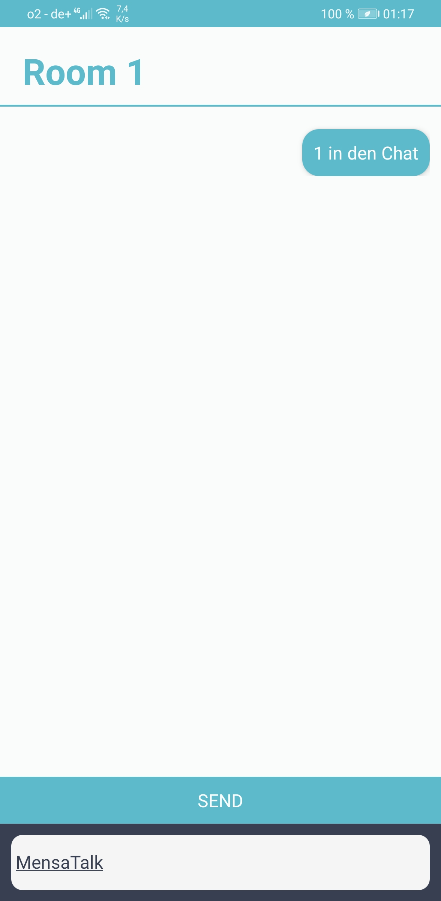

# MensaTalk App

## Table of Contents

-   [About the Project](#about-the-project)
-   [Getting Started](#getting-started)
    -   [Installation](#installation)
    -   [Usage](#usage)

<!-- ABOUT THE PROJECT -->

## About The Project

<p align="center">

</p>


## Getting Started

To get a local copy up and running follow these simple example steps.


### Installation

1. Clone the repo

```sh
git clone https://github.com/mensatalk/mensatalk_app.git
```

2. Install NPM packages

```sh
npm install
```

### Usage

Run on android

```
npx react-native run-android
```

Run on iOS
```
npx react-native run-ios
```
