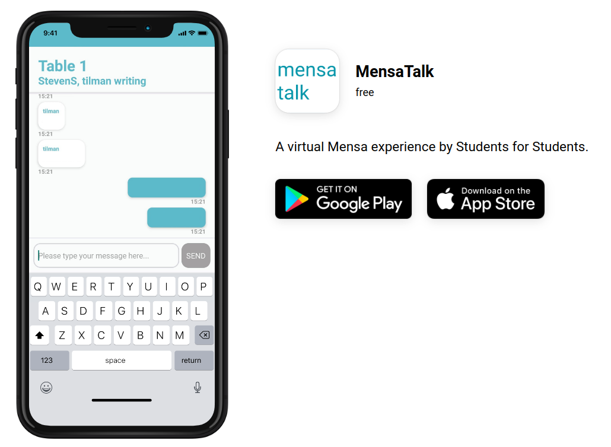

<p align="center">

</p>


## Getting Started

To get a local copy up and running follow these simple example steps.


### Installation

1. Clone the repo

```sh
git clone https://github.com/mensatalk/mensatalk_app.git
```

2. Install NPM packages

```sh
npm install
```

### Usage

Run on android

```
npx react-native run-android
```

Run on iOS
```
npx react-native run-ios
```

### Release

- Build for Android see [Publishing to Google Play Store](https://reactnative.dev/docs/signed-apk-android)
- Build for iOS see [Publishing to Google Play Store](https://reactnative.dev/docs/next/publishing-to-app-store)

## License

BSD 3-Clause "New" or "Revised" see: [LICENSE](LICENSE)